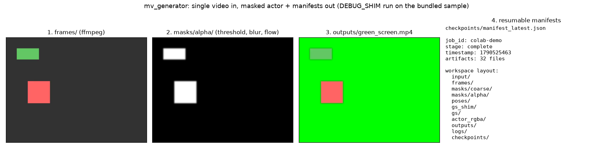
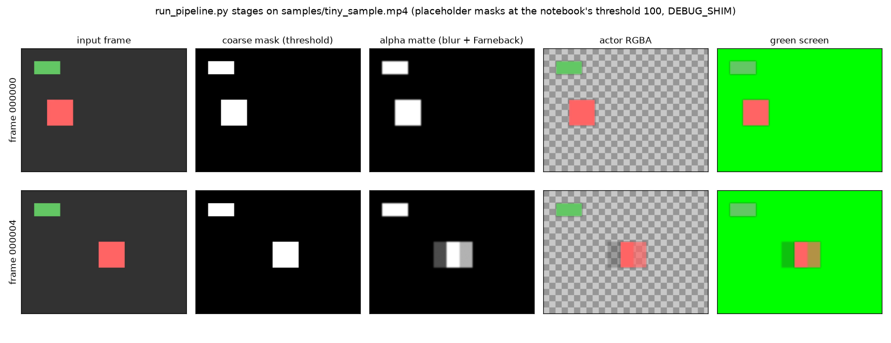
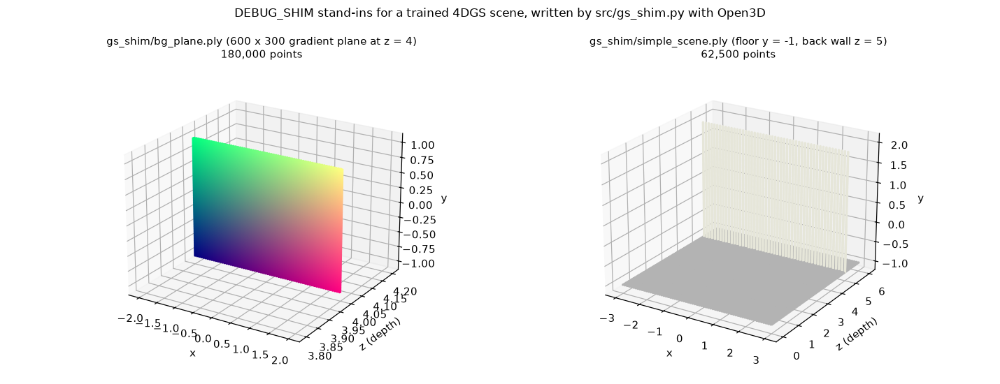
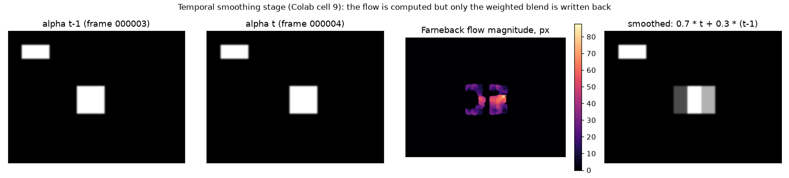

<h1 align="center">mv_generator</h1>

<p align="center">
  <a href="LICENSE"></a>
  
  
  
  
  <a href="https://colab.research.google.com/github/yc9954/mv_generator/blob/claude/4dgs-colab-setup-01EzHeaT6YawPrxxsB3bYmUp/notebooks/colab_pipeline.ipynb"></a>
</p>

<p align="center">
  <strong>A Colab and RunPod scaffold for a single-video-to-4D-Gaussian-Splatting pipeline, with a shim for every heavy stage.</strong><br/>
  Upload a video, extract frames, mask the subject, estimate poses, train 4DGS, and export the actor as RGBA<br/>
  or over a green screen. Every stage writes a JSON manifest to Drive or <code>/workspace</code> so a run can be resumed.<br/>
  In its current state most stages run as lightweight placeholders; see <a href="#project-status">Project status</a> before relying on the output.
</p>

<h3 align="center"><a href="#getting-started"><ins>Getting started</ins></a></h3>

<p align="center">
  
</p>
<p align="center">
  <sub>The four things a run leaves behind: extracted frames, alpha mattes, the green-screen render, and a resumable manifest.
  Produced by <code>scripts/render_docs_figures.py</code>, which runs the <code>run_pipeline.py</code> stage functions on
  <code>samples/tiny_sample.mp4</code> on a CPU with <code>DEBUG_SHIM</code> on; every image in this README comes from that run.</sub>
</p>

## Features

<table>
<tr>
<td width="50%" valign="middle">

### Two notebooks, one script

`notebooks/colab_pipeline.ipynb` (36 cells, Google Drive workspace) and `notebooks/runpod_pipeline.ipynb` (18 cells, `/workspace`) walk through the same stages; `run_pipeline.py` is the non-interactive RunPod version.

The stage strip on the right is what the script produces: FFmpeg frames, a brightness-threshold mask, a blurred matte that the Farneback stage blends with the previous frame, the RGBA actor, and the green-screen frame. The ghost behind the moving square in the last row is the temporal blend doing exactly what the code says (0.7 × current + 0.3 × previous).

</td>
<td width="50%">
  
</td>
</tr>
<tr>
<td width="50%" valign="middle">

### `DEBUG_SHIM` switch

`True` runs the whole flow in minutes with Python placeholders and an Open3D point cloud instead of a trained model; `False` expects a built [hustvl/4DGaussians](https://github.com/hustvl/4DGaussians) checkout at `FOURGS_REPO`.

`src/gs_shim.py` writes the stand-ins with Open3D: a 600 × 300 gradient plane (`generate_bg_plane`), the same plane with random depth jitter (`generate_bg_plane_with_depth_variation`), and a floor-plus-back-wall scene (`create_simple_scene`). `load_and_preview_ply` reports point count and bounds.

</td>
<td width="50%">
  
</td>
</tr>
<tr>
<td width="50%" valign="middle">

### Masks, mattes and temporal smoothing

Coarse mask by brightness threshold, alpha matte by Gaussian blur, then (Colab notebook only) OpenCV Farneback optical flow between consecutive mattes and a fixed 0.7 / 0.3 blend written back in place.

The flow field is computed but not used to warp anything; only the weighted average is written. Hooks for SAM and RVM checkpoints exist but fall back to the placeholders.

</td>
<td width="50%">
  
</td>
</tr>
</table>

**Also included**

- **Actor export.** Frames are composited with their mattes into RGBA PNGs; on RunPod `render_green_screen` also writes the subject over a solid green background as `outputs/green_screen.mp4` for compositing.
- **Manifests and resume.** `save_manifest` / `load_manifest` record each stage's artifacts and timestamp under `checkpoints/`, `save_runs_meta` records GPU and config, and `scripts/save_manifest.py` does the same from the shell. `run_log_example.json` shows a complete manifest.
- **Self-bootstrapping RunPod script.** `run_pipeline.py` installs FFmpeg and the Python packages, downgrades PyTorch to 1.13.1 (+cu117) when 4DGS mode is on, clones 4DGaussians with submodules and builds `diff-gaussian-rasterization` and `simple-knn`, then exits once so the new torch can load.
- `scripts/build_4dgs_shim.sh`, an interactive build of 4DGaussians on Colab; `scripts/run_colab_headless.sh`, papermill execution of the notebook for unattended runs; `scripts/render_docs_figures.py`, the local CPU run that made the images above.
- `env.template` listing every knob (`ROOT`, `DEBUG_SHIM`, `SAM_CHECKPOINT`, `RVM_CHECKPOINT`, `FOURGS_REPO`, `COLMAP_BIN`, `FPS`, shim grid size, output size).
- 31 pytest unit tests for the helpers and the shim.

---

## How it works

```text
input.mp4
  │ ffmpeg -vf fps=FPS
  ▼
frames/*.png ──▶ masks/coarse (threshold) ──▶ masks/alpha (blur) ──▶ Farneback temporal smoothing
  │                                                                          │
  ├──▶ poses/poses.json   (pycolmap if importable, else placeholder poses)   │
  │                                                                          ▼
  ├──▶ DEBUG_SHIM=True : gs_shim/bg_plane.ply (Open3D plane)        actor_rgba/*.png
  │    DEBUG_SHIM=False: python $FOURGS_REPO/train.py -s frames -m gs --eval
  ▼
outputs/preview.mp4 (actor over background)  ·  outputs/green_screen.mp4 (RunPod)  ·  outputs/sr_sample.png
checkpoints/manifest_<stage>.json  ·  runs_meta.json  ·  logs/*.log
```

1. **Runtime check.** `nvidia-smi`, A100 detection, and (RunPod) disk space.
2. **Workspace.** `ensure_dirs(ROOT)` creates `input/ frames/ masks/{coarse,alpha}/ poses/ gs_shim/ gs/ actor_rgba/ outputs/ logs/ checkpoints/`.
3. **Input.** Upload through the browser, point at a Drive file, or pass `--input`; `validate_input_video` checks it opens and has frames.
4. **Stages 6 to 15** run in order as drawn above; each one prints its method and whether it used a placeholder.
5. **Manifest.** The final cell writes `checkpoints/manifest_complete.json`; re-run the configuration cell and continue from any later cell to resume.

<details>
<summary><strong>What is real and what is a placeholder, per stage</strong></summary>

| Stage | Colab notebook | `run_pipeline.py` / RunPod notebook |
| --- | --- | --- |
| Frame extraction | FFmpeg, real | FFmpeg, real |
| Coarse segmentation | brightness threshold at 100; SAM branch prints "not yet implemented" | threshold at 30 (`generate_masks(threshold=...)` to change) |
| Alpha matting | 15 × 15 Gaussian blur of the mask; RVM branch not implemented | 7 × 7 Gaussian blur |
| Temporal smoothing | Farneback flow computed, 0.7 / 0.3 blend written | not present |
| Camera poses | `pycolmap` if installed; otherwise identity poses with a 0.1 m x-offset per frame (the "OpenCV SIFT+PnP fallback" label is aspirational, no SIFT runs) | identity poses |
| 4DGS training | `subprocess.run(train.py ...)` when `DEBUG_SHIM=False` and the repo exists | command is printed, not executed; `gs/output.ply` is touched |
| Actor RGBA / preview | real compositing | real compositing + green screen |
| Super-resolution | bicubic 2x; Real-ESRGAN branch not implemented | not present |

</details>

---

## Tech stack

<p>
  <kbd>Python&nbsp;3.10+</kbd> &nbsp; <kbd>Jupyter&nbsp;/&nbsp;Colab</kbd> &nbsp; <kbd>papermill</kbd> &nbsp; <kbd>FFmpeg</kbd> &nbsp; <kbd>OpenCV</kbd> &nbsp; <kbd>NumPy&nbsp;&lt;1.24</kbd> &nbsp; <kbd>Open3D</kbd> &nbsp; <kbd>trimesh</kbd> &nbsp;
  <kbd>PyTorch&nbsp;1.13.1</kbd> &nbsp; <kbd>hustvl/4DGaussians</kbd> &nbsp; <kbd>pytest</kbd>
</p>

---

## Getting started

**Prerequisites**

- Colab: a GPU runtime (the notebook records whether it is an A100). Free tier works for `DEBUG_SHIM=True`.
- RunPod: a CUDA 11.7/11.8 template with `/workspace` attached. 4DGaussians needs PyTorch 1.13.1; the script downgrades a newer torch automatically, so do not start from a PyTorch 2.x template you want to keep.
- Locally: Python 3.10+, FFmpeg, and `pip install opencv-python-headless numpy open3d tqdm matplotlib pytest` are enough for the tests and the CPU demo below.

**Colab**

1. Open the notebook with the badge above (it points at this repo's default branch).
2. Run cell 1 and 2 to mount Drive; the workspace is `/content/drive/MyDrive/mvp_4dgs_job`.
3. In the configuration cell set `DEBUG_SHIM = True` for the demo path (the committed default is `False`, which expects a built 4DGaussians at `/content/4dgs_repo`; the last cell builds it, 10 to 20 minutes).
4. Run the remaining cells in order. Outputs and manifests land on Drive.

**RunPod**

```bash
bash <(curl -fsSL https://raw.githubusercontent.com/yc9954/mv_generator/claude/4dgs-colab-setup-01EzHeaT6YawPrxxsB3bYmUp/easy_start.sh)   # clones this branch
cd mv_generator

python run_pipeline.py --input my_video.mp4 --debug_shim      # placeholder run, no CUDA build
python run_pipeline.py --input my_video.mp4                   # installs torch 1.13.1 + builds 4DGS, then asks you to re-run once
```

| Flag | Default | What it does |
| --- | --- | --- |
| `--root` | `/workspace/mvp_4dgs_job` | Workspace with the directory layout above. |
| `--input`, `-i` | `ROOT/input/input.mp4` | Video to process; copied into the workspace. |
| `--fps` | `30` | Extraction rate. |
| `--debug_shim` | off | Skip the 4DGS build and touch a fake `gs/output.ply`. |
| `--repo` | `/workspace/4dgs_repo` | Where 4DGaussians is cloned and built. |

**Local CPU demo (what made the figures)**

```bash
python scripts/render_docs_figures.py --root /tmp/mv_demo     # ~10 s; writes docs/*.png and a full workspace under /tmp/mv_demo
```

It imports the stage functions from `run_pipeline.py` instead of running the script, because `run_pipeline.py` starts with `apt-get` and `pip install` and assumes `/workspace`.

**Headless Colab notebook**

```bash
bash scripts/run_colab_headless.sh notebooks/colab_pipeline.ipynb notebooks/colab_pipeline_executed.ipynb
```

---

## Building and testing

```bash
pip install pytest pytest-cov open3d
pytest tests/                       # 17 helper tests + 14 shim tests; Open3D-dependent ones skip if it is missing
pytest tests/ --cov=src --cov-report=html
```

`samples/synthetic_test_frames/` holds five 640x480 PNGs of a moving red rectangle (and a static green one) for the tests. `samples/tiny_sample.mp4` is those five frames encoded at 5 fps with the FFmpeg line in `samples/README.md`.

---

## Notebooks

| File | Cells | What it does |
| --- | --- | --- |
| `notebooks/colab_pipeline.ipynb` | 36 | Full 17-step Colab flow: GPU check, Drive mount, configuration, install, upload, frames, coarse masks, mattes, temporal smoothing, poses, GS shim, real 4DGS, actor RGBA, preview, SR test, manifest, 4DGS build instructions. |
| `notebooks/runpod_pipeline.ipynb` | 18 | Condensed RunPod flow with `DEBUG_SHIM=False` default, dependency install and CUDA-extension check, frames, placeholder masks and poses, simulated training, actor RGBA, green-screen render. |

---

## Repository structure

| Path | What lives there |
| --- | --- |
| `notebooks/` | The two notebooks above. |
| `run_pipeline.py` | RunPod CLI: runtime check, dependency and 4DGS bootstrap, frames, masks, poses, (simulated) training, RGBA and green-screen export. |
| `src/colab_helpers.py`, `src/runpod_helpers.py` | `ensure_dirs`, `sha256`, `log_and_print`, `save_manifest`, `load_manifest`, `save_runs_meta`, `list_artifacts`, `validate_input_video`; the RunPod copy adds `render_green_screen`. |
| `src/gs_shim.py` | Open3D point-cloud stand-ins for a trained scene. |
| `scripts/` | `save_manifest.py`, `build_4dgs_shim.sh`, `run_colab_headless.sh`, `render_docs_figures.py`. |
| `tests/` | `test_colab_helpers.py`, `test_gs_shim.py`. |
| `samples/` | Synthetic test frames and the 5-frame sample video. |
| `docs/` | The figures in this README. |
| `easy_start.sh`, `env.template`, `requirements.txt`, `run_log_example.json`, `CHANGELOG.md` | Bootstrap, configuration reference, pinned dependencies, example manifest, 1.0.0 release notes. |

---

## Project status

**Working today.** The scaffolding: workspace layout, manifests and resume, FFmpeg frame extraction, threshold masks and blurred mattes, Farneback temporal smoothing (Colab), RGBA export, preview and green-screen videos, the RunPod dependency bootstrap with PyTorch downgrade and CUDA-extension build, and the unit tests. The figures above are from a real run of these parts.

**Placeholder by design, for now.** Segmentation, matting, super-resolution and camera poses are stubs: the SAM, RVM, Real-ESRGAN and SIFT+PnP branches described in the earlier README and CHANGELOG are not implemented, and `poses.json` contains synthetic identity transforms unless `pycolmap` happens to be importable. Because the poses are fake, a 4DGS model trained from this pipeline will not be meaningful even when `train.py` does run. `run_pipeline.py` and the RunPod notebook never execute training; the Colab notebook does when `DEBUG_SHIM=False` and the repo exists.

**Known limitations.**
- The two mask thresholds disagree: the notebook uses 100, `run_pipeline.py` defaults to 30. At 30 the bundled sample's `#333` background (gray level 51) counts as foreground and the mask is solid white; the figures above pass `threshold=100` to the script's `generate_masks`.
- `run_pipeline.py` calls `install_dependencies()` twice (once before importing the helpers, once after copying the input), so `apt-get` and `pip install` run twice per launch.
- `requirements.txt` pins `numpy<1.24` and `torch==1.13.1`, which conflicts with a modern Colab image; the notebooks install their own smaller set instead.
- The runtime numbers in `run_log_example.json` are an illustrative manifest, not a measured run. Commit history covers 2025-12-06 to 2025-12-08; the roadmap in the earlier README (SAM2, RVM, RAFT, multi-GPU, web UI, batch mode) is unstarted.

**Credits.** [4DGaussians](https://github.com/hustvl/4DGaussians) (training and CUDA rasterizer), [Segment Anything](https://github.com/facebookresearch/segment-anything), [Robust Video Matting](https://github.com/PeterL1n/RobustVideoMatting), [COLMAP](https://colmap.github.io/), [Open3D](http://www.open3d.org/), [Real-ESRGAN](https://github.com/xinntao/Real-ESRGAN).

---

## License

[MIT](LICENSE).
